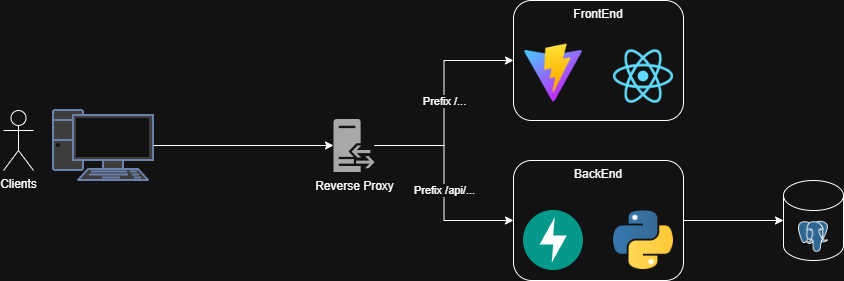
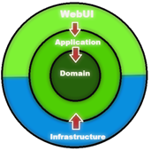
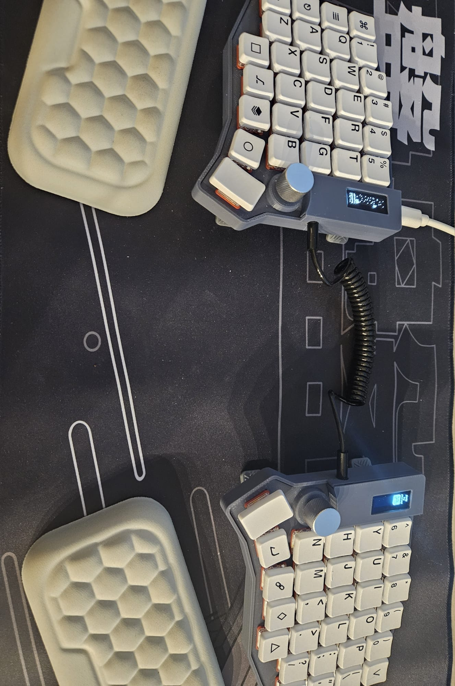

# Task Manager

## High Level Design

This is the high-level design of the system. The main components are:

- Frontend: UI to manage the tasks. It will be written with React using Vite.
- Backend: Service that will save and manage tasks. It will be written using Python and FastAPI.
- Database: PostgreSQL to store tasks. I will use SQLAlchemy for the ORM and Alembic for migrations.
- Reverse proxy: Nginx (or another reverse proxy managed by the cloud platform) that routes HTTP requests to the appropriate service.

Note: I will deploy the project to Azure (I have some free student credits). I will use GitHub Actions to build the projects, run tests, and deploy the project.

## Low Level Design

### BackEnd

Here I will explain the different modules, classes, and schemas of the system.
The base design philosophy for this project will be the "Clean Architecture" approach. The advantages are that it's very modular, maintainable, and testable. It is definitely a bit overkill for this kind of project, but it keeps the code well organized (I will explain the parts of the architecture below the class diagram).

 _Clean Architecture layers diagram_

#### Class diagram

Note: this diagram only contains the core classes of the app. The application will include many more classes (exceptions, request/response models, config, DI configuration, etc.).

this is an svg, if you don't see it well in the github ui, download it so you can zoom in

**Explanation**

There are four layers, each layer only depends on inner layers.

Domain: Includes our entities (Task) and the operations you can perform on them.

The domain contains the Task entity and the ITaskRepository interface. The repository is an interface that defines what can be performed on tasks, it will be implemented in outer layers and injected (dependency inversion). This makes the code modular: if you want to replace PostgreSQL with MongoDB or another store, you only need to change the outer layer and never touch this layer.

Services: This layer implements business logic (for example, in a TaskService class). This is a simple app, so there isn't much logic initially, but the structure allows the logic to grow.

Infrastructure: This layer provides database connections and implementations of ITaskRepository. If we change how tasks are stored, we only need to update this layer.

API: This layer contains the FastAPI routers. Routers will use the task service to handle HTTP requests and return responses.

I will also add unit tests to the app. For those tests I will mock the ITaskRepository to test application logic. Note: because there isn't much logic initially, there will be a limited number of tests at first.

### FrontEnd

There is not much to say about the frontend.

Framework: React + Vite

Design and component libraries: CSS Modules + Ant Design (from my experience this is a great combo to build customizable, good looking UIs quickly).

Pages:

- Tasks page:
  This page will include the list of the tasks, above the tasks there will be filter and sort options.
  For each task you will be able to mark it as completed and delete it.
  Also there will be a button to export the tasks.

* Note about the file structure I will use for the frontend code:

- `components/`: contains reusable components used across the app.
- `pages/`: contains page components (each page as a folder).

Each component or page will be in its own folder and include the .tsx file, CSS file, any config/constants, and internal interfaces.

## Things that can be added in the future

As requested, here is a list of features that can be added to this project in the future.
I didn't include these for the initial version because some may be overkill, but none of them should take more than ~30 minutes each to add.

- Auth and user management: The initial system targets a single main user with no authentication. Adding login with OAuth2 (Google/GitHub) and user management would improve the app.
- Notifications: Notify users via email / WhatsApp / Telegram for updates (new task, task about to be due, etc.).
- Log to Elasticsearch: Currently I will log to the console. It's generally better to ship logs to Elasticsearch, this can be done by redirecting logs to files and shipping them with Filebeat.
- Frontend testing: I can add tests to the frontend. In many small projects frontend testing may be overkill, but it can be added if needed.

---

Note: sorry if this document contains any weird typos — I'm practicing typing quickly with a new unconventional keyboard. For reference, this is the keyboard used while writing this project:

